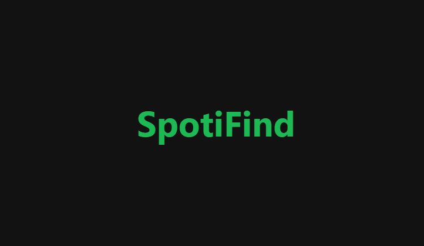
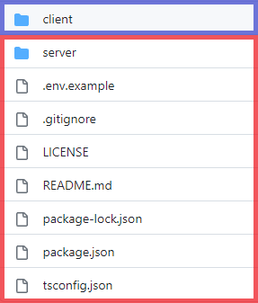

# **SpotiFind**

<p align="center">

</p>

## About the project

Spoti-Find is a web project that allows the users to explore songs, discover new artists or find albums by the artist's name. \
This project uses the [Spotify Web API](https://developer.spotify.com/) to get the information of an artist and his albums.

## Quick Start

This project is composed of two independent projects: **Front** or **Client-Side** (blue) and **Back** or **Server-Side** (red). Both sections, **Client-Side** and **Server-Side** are different npm projects, so them got different **package.json**, different dependencies and different scripts.

<p align="center">

</p>

### _Client-Side_

The **Client-Side** section is located in the "client" folder.

**In this section we're going to work with:**

- [React](https://react.dev/)
- [TypeScript](https://www.typescriptlang.org/docs/handbook/react.html) (TSX)
- [TailwindCSS](https://tailwindcss.com/)

> If you don't are familiarized with some of these technologies you can access the links and read the official documentation.

Inside the "client" folder you'll find many files and folders, I'll give a brief explain of them, first the files outside the "src" folder:

- **_.gitignore_** - This file duty is to tell Git to ignore some files that we aren't interested to push to the repository, for example: the **.env** file or the **node_modules** folder.

- **_index.html_** - Is the base template, all the **_React_** components are render there after build.

- **_package-lock.json_** - This file is automatically generated for any operations where npm modifies the **node_modules** tree or the **package.json** file.

- **_package.json_** - In this file we'll see information about our project, dependencies and scripts.

- **_postcss.config.js_** and **_tailwind.config.js_** - These two are separated files, but both are configuraton files to use **_TailwindCSS_**.

- **_tsconfig.json_** - In this file you'll find the **_TypeScript_** configuration for the code.

- **_tsconfig.node.json_** and **_vite.config.ts_** - These two are separated files, but both are configuraton files to use **_TypeScript_**.

And now the files and folders inside "src" folder:

- **_main.tsx_** - The main file of the **Client-Side** section, all the others files are contained here in some way.

- **_index.css_** - The CSS file of the entire section.

- **_App.tsx_** - This file is the principal component, there are defined the routes and the elements that are going to be rendered when the route is called.

- **_types_** - This is a core folder when working with **_TypeScript_**, here you'll find all the types that we'll be using in this section.

- **_redux_** - In this folder you'll find the logic of the **redux** dependency.

- **_components_** - This folder contains all the **React** components (tsx) and its respective css in case of necessary use.

- **_axios_calls_** - There we define the necessary calls that we're going to use in the **Client-Side** section.

### _Server-Side_

The **Server-Side** section is located in root and "server" folder.

**In this section we're going to work with:**

- [Node.js](https://nodejs.org/)
- [TypeScript](https://www.typescriptlang.org/)
- [Express](https://expressjs.com/)
- [Sequelize](https://sequelize.org/)
- [Axios](https://axios-http.com/docs/intro)

> If you don't are familiarized with some of these technologies you can access the links and read the official documentation.

There you can find several folders, I'm going to list them and give a a brief description of how it works, first the files outside the server folder:

- **_.prettierrc_** - In this file we'll tell **prettier** the formating options for the code.

- **_LICENCE_** - This is the licence file, it tells to the users what they can do with this code.

Now the files inside the **server** folder.

- **_server.ts_** - The "engine" of the **Server-Side** section, this file duty is to start the server, all the others files are related to _server.ts_ in some way, although many features like define the database connection or define the routes, is in this file were all is executed.

- **_controllers_** - In this folder you'll find the controllers functions for the routes, these functions will execute when the endpoint of the route is called.

- **_routes_** - This folder contains the routes, here we'll define the endpoints of the **Server-Side** section, and asing to each route one controller.

- **_db_** - Here we'll configure the database connection with sequelize.

- **_models_** - In this folder we'll define the models for the database.

- **_types_** - This is a core folder when working with **_TypeScript_**, here you'll find all the types that we'll be using in this section.

- **_.env.example_** - There you'll find the environments variables, these are necessary for the application to work.

- **_.gitignore_** - This file duty is to tell Git to ignore some files that we aren't interested to push to the repository, for example: the **.env** file or the **node_modules** folder.

- **_package-lock.json_** - This file is automatically generated for any operations where npm modifies the **node_modules** tree or the **package.json** file.

- **_package.json_** - In this file we'll see information about our project, dependencies and scripts.

- **_README.md_** - The file that you're reading right now, it duty is to easily communicate what's the project about and the necessary knowledgements to use it or improve it.

- **_tsconfig.json_** - In this file you'll find the **_TypeScript_** configuration for the code.

- **_axios_calls_** - There we define the necessary calls that we're going to use in the **Server-Side** section.

## Axios calls

We're going to use Axios to fetch data, from the **Server-Side** we are going to make them to [Spotify Web API](https://developer.spotify.com/) and from the **Client-Side** we are going to make them to **Server-Side** and to [API Ipify](https://api.ipify.org).\
If it is necessary to make new calls, there are some considerations to be taken:

- You'll have to explicit point the type of the response and the type of the body, if it doesn't exist you must create it.
- The call's name must be descriptive.
- If the new call don't match with one of the existing files themes you must create a new file.

> You can learn more about Axios's configuration file [there](https://www.delftstack.com/howto/typescript/axios-typescript/#create-an-axios-config-file-in-typescript)

## Setting up the development environment

You can freely clone this repository and contribute to it, there is a quick guide of how to do it.\
After clone the repository, you'll have to install the necessary dependencies for both **Server-Side** and **Client-Side**:

For **Server-Side** (from root directory)

```
cd server
npm i
```

For **Client-Side** (from root directory)

```
cd client
npm i
```

You'll have to fill your owns environments variables too, copy the **.env.example** content and create a **.env** file, this file is locale and not is going to be pushed to git so the information there is safe.

All your contributions have to be done in the "develop" branch, after pushing your changes will be reviewed and if it passes all the tests it will be merged to main branch.

### Scritps

#### Run **Server-Side** script:

```powershell
npm run back
```

#### Run **Client-Side** script:

```powershell
cd client
```

Make sure that you are in "client" folder, and then run script:

```powershell
npm run dev
```

## Contributing

Pull requests are welcome. For major changes, please open an issue first
to discuss what you would like to change.

Please make sure to update tests as appropriate.

## License

[MIT](https://choosealicense.com/licenses/mit/)
