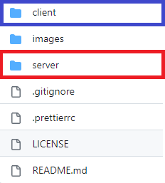

# **Spoti-Find**

Spoti-Find is a web project that allows the users to find artists albums by the artist's name.

## About the project

This project use the [Spotify Web API](https://developer.spotify.com/) to get the information of an artist and his albums.

## Quick Start

To easily understand this project can be separeted in two sections: **Front** or **Client-Side** (blue) and **Back** or **Server-Side** (red). Both sections, **Client-Side** and **Server-Side** are different npm projects, so them got different **package.json**, different dependencies and different scripts.

<p align="center">

</p>

### _Client-Side_

The **Client-Side** section is located in the "client" folder.

**In this section we're going to work with:**

- [React](https://react.dev/)
- [TypeScript](https://www.typescriptlang.org/docs/handbook/react.html) (TSX)
- [TailwindCSS](https://tailwindcss.com/)

> If you don't are familiarized with some of these technologies you can access the links and read the official documentation.

Inside the "client" folder you'll find many files and folders, I'll give a brief explain of them, first the files outside the "src" folder:

- **_.gitignore_** - This file duty is to tell Git to ignore some files that we aren't interested to push to the repository, for example: the **.env** file or the **node_modules** folder.

- **_index.html_** - Is the base template, all the **_React_** components are render there after build.

- **_package-lock.json_** - This file is automatically generated for any operations where npm modifies the **node_modules** tree or the **package.json** file.

- **_package.json_** - In this file we'll see information about our project, dependencies and scripts.

- **_postcss.config.js_** and **_tailwind.config.js_** - These two are separated files, but both are configuraton files to use **_TailwindCSS_**.

- **_tsconfig.json_** - In this file you'll find the **_TypeScript_** configuration for the code.

- **_tsconfig.node.json_** and **_vite.config.ts_** - These two are separated files, but both are configuraton files to use **_TypeScript_**.

And now the files and folders inside "src" folder:

- **_main.tsx_** - The main file of the **Client-Side** section, all the others files are contained here in some way.

- **_index.css_** - The CSS file of the entire section.

- **_App.tsx_** - This file is the principal component, there are defined the routes and the elements that are going to be rendered when the route is called.

- **_types_** - This is a core folder when working with **_TypeScript_**, here you'll find all the types that we'll be using in this section.

- **_redux_** - In this folder you'll find the logic of the **redux** dependency.

- **_components_** - This folder contains all the **React** components (tsx) and its respective css in case of necessary use.

- **_axios_calls_** - There we define the necessary calls that we're going to use in the **Client-Side** section.

### _Server-Side_

The **Server-Side** section is ubicated in root and "server" folder.

**In this section we're going to work with:**

- [Node.js](https://nodejs.org/)
- [TypeScript](https://www.typescriptlang.org/)
- [Express](https://expressjs.com/)
- [Sequelize](https://sequelize.org/)
- [Axios](https://axios-http.com/docs/intro)

> If you don't are familiarized with some of these technologies you can access the links and read the official documentation.

There you can find several folders, I'm going to list them and give a brief description of it function, first the files outside the server folder:

- **_.env.example_** - There you'll find the environments variables, these are necessary for the application to work.

- **_.gitignore_** - This file duty is to tell Git to ignore some files that we aren't interested to push to the repository, for example: the **.env** file or the **node_modules** folder.

- **_.prettierrc_** - In this file we'll tell **prettier** the formating options for the code.

- **_LICENCE_** - This is the licence file, it tells to the users what they can do with this code.

- **_package-lock.json_** - This file is automatically generated for any operations where npm modifies the **node_modules** tree or the **package.json** file.

- **_package.json_** - In this file we'll see information about our project, dependencies and scripts.

- **_README.md_** - The file that you're reading right now, it duty is to easily communicate what's the project about and the necessary knowledgements to use it or improve it.

- **_tsconfig.json_** - In this file you'll find the **_TypeScript_** configuration for the code.

Now the files inside the **server** folder.

- **_server.ts_** - The "engine" of the **Server-Side** section, this file duty is to start the server, all the others files are related to _server.ts_ in some way, although many features like define the database connection or define the routes, is in this file were all is executed.

- **_controllers_** - In this folder you'll find the controllers functions for the routes, these functions will execute when the endpoint of the route is called.

- **_routes_** - This folder contains the routes, here we'll define the endpoints of the **Server-Side** section, and asing to each route one controller.

- **_db_** - Here we'll configure the database connection with sequelize.

- **_models_** - In this folder we'll define the models for the database.

- **_types_** - This is a core folder when working with **_TypeScript_**, here you'll find all the types that we'll be using in this section.

- **_axios_calls_** - There we define the necessary calls that we're going to use in the **Server-Side** section.

## Scritps

### Run **Server-Side** script:

```powershell
npm run back
```

### Run **Client-Side** script:

```powershell
cd client
```

Make sure that you are in "client" folder, and then run script:

```powershell
npm run dev
```

## Contributing

Pull requests are welcome. For major changes, please open an issue first
to discuss what you would like to change.

Please make sure to update tests as appropriate.

## License

[MIT](https://choosealicense.com/licenses/mit/)
